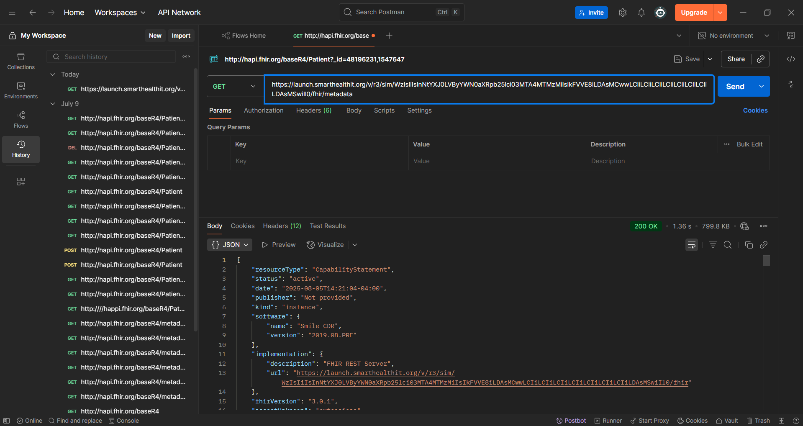

# DEVELOPING AN API IN SMART FHIR STU3 V3.1.0 ON WINDOWS - PART 3

This is a tutorial in how to access SMART FHIR servers via C# and .Net Core with a local webserver for redirection.
It consists in studiying and testing  SMART OAuth endpoints in the FHIR server’s capability, specifically searching for the authorize and token URLs under the extension:

- http://fhir-registry.smarthealthit.org/StructureDefinition/oauth-uris

being required to integrate SMART apps with FHIR servers using OAuth2.

## Needed Tools

For developing this part of the project it will be needed the same tools and knowledge from the previous projects and some of content presented bellow.

- [**Part 1 :**](https://github.com/orlandonss/HL7-FHIR)
  How to create a project from scratch.
- [**Part 2 :**](https://github.com/orlandonss/HL7-FHIR-2)
  How to create a local Fhir server  from scratch using a docker.
- [**SMARTH FHIR**](https://launch.smarthealthit.org/?fhir_version=r3&launch=WzIsIiIsInNtYXJ0LVByYWN0aXRpb25lci03MTA4MTMzMiIsIkFVVE8iLDAsMCwwLCIiLCIiLCIiLCIiLCIiLCIiLCIiLDAsMSwiIl0&tab=0) Serve as Endpoint Server.

- [**Keycloack (Optional)**](https://github.com/opensrp/hapi-fhir-keycloak) Serve as a authenticator / authorizer.

## Nuget packages

A curated list of required packages with versions and direct NuGet links.
Easily add them to your project using `dotnet add package`.

### 🏥 HL7 FHIR

- **[Hl7.Fhir.R4](https://www.nuget.org/packages/Hl7.Fhir.Support/3.1.0)**
  ```bash
  dotnet add package Hl7.Fhir.STU3 --version 3.1.0
  dotnet add package Hl7.Fhir.STU3.Specification --version 3.1.0
  ```

### 🌐 ASP.NET Core

- **[Microsoft.AspNetCore.App](https://www.nuget.org/packages/Microsoft.AspNetCore.App/2.2.8)**

  ```bash
  dotnet add package Microsoft.AspNetCore.App --version 2.2.8
  ```
- **[Microsoft.AspNetCore.Cors](https://www.nuget.org/packages/Microsoft.AspNetCore.Cors/2.2.0)**

  ```bash
  dotnet add package Microsoft.AspNetCore.Cors --version 2.2.0
  ```
- **[Microsoft.AspNetCore.Razor.Design](https://www.nuget.org/packages/Microsoft.AspNetCore.Razor.Design/2.2.0)**

  ```bash
  dotnet add package Microsoft.AspNetCore.Razor.Design --version 2.2.0
  ```

### ⚙️ Configuration

- **[Microsoft.Extensions.Configuration](https://www.nuget.org/packages/Microsoft.Extensions.Configuration/3.1.9)**

  ```bash
  dotnet add package Microsoft.Extensions.Configuration --version 3.1.9
  ```
- **[Microsoft.Extensions.Configuration.EnvironmentVariables](https://www.nuget.org/packages/Microsoft.Extensions.Configuration.EnvironmentVariables/3.1.9)**

  ```bash
  dotnet add package Microsoft.Extensions.Configuration.EnvironmentVariables --version 3.1.9
  ```
- **[Microsoft.Extensions.Configuration.Json](https://www.nuget.org/packages/Microsoft.Extensions.Configuration.Json/3.1.9)**

  ```bash
  dotnet add package Microsoft.Extensions.Configuration.Json --version 3.1.9
  ```

### 💻 CLI Tools

- **[System.CommandLine.DragonFruit](https://www.nuget.org/packages/System.CommandLine.DragonFruit/0.3.0-alpha.20371.2)**
  ```bash
  dotnet add package System.CommandLine.DragonFruit --version 0.3.0-alpha.20371.2
  ```

# Starting the Development

We will be following the model bellow and toghether construct an strong and based API.


- https://hl7.org/fhir/smart-app-launch/

## USING SMART FHIR

These are the following configurations used to be implemmented the in the tests.
Copy and paste the link to a variable in the **<filename.cs>**.


**Following code:**
```csharp
 private const string DefaultFhirServerUrl ="https://launch.smarthealthit.org/v/r3/sim/WzIsIiIsInNtYXJ0LVByYWN0aXRpb25lci03MTA4MTMzMiIsIkFVVE8iLDAsMCwwLCIiLCIiLCIiLCIiLCIiLCIiLCIiLDAsMSwiIl0/fhir";

        // Valid entry point
        public static int Main(string fhirServerUrl )
        {
            // Use the first arg if provided; otherwise fall back to the default
            if (string.IsNullOrWhiteSpace(fhirServerUrl)) {
                fhirServerUrl = DefaultFhirServerUrl;
            }
                
            Console.WriteLine($"FHIR Server: {fhirServerUrl}");
            Console.WriteLine("Press Enter to exit...");
            Console.ReadLine();
            return 0;
        }
```

### Postman test




### Getting the identifier url:
Copy the URL into the code:


### Get Smart URIS
In the file <FhirUtils.cs> is present the following to code to get SMART URIS.

**This method:**
- Connects to a FHIR server using a FhirClient
- Downloads the CapabilityStatement (aka the server's "conformance" statement)
- Looks for the OAuth2 URLs required by SMART on FHIR under a specific extension
- Returns the authorizeUrl and tokenUrl
- Returns true if both were found, false otherwise


```csharp
using System;
using System.Collections.Generic;
using Hl7.Fhir.Model;
using Hl7.Fhir.Rest;
using Hl7.Fhir.Serialization;

namespace smart_local
{
    /// <summary>
    /// FHIR Utility functions
    /// </summary>
    public static class FhirUtils
    {
        public static bool GetSmartUrls(FhirClient fhirClient, out string authorizeUrl, out string tokenUrl)
        {
            authorizeUrl = string.Empty;
            tokenUrl = string.Empty;

            CapabilityStatement capabilities = (CapabilityStatement)fhirClient.Get("metadata");

            foreach (CapabilityStatement.RestComponent restComponent in capabilities.Rest)
            {
                if (restComponent.Security == null)
                {
                    continue;
                }

                foreach (Extension securityExt in restComponent.Security.Extension)
                {
                    if (securityExt.Url != "http://fhir-registry.smarthealthit.org/StructureDefinition/oauth-uris")
                    {
                        continue;
                    }

                    if (securityExt.Extension == null || securityExt.Extension.Count == 0)
                    {
                        continue;
                    }

                    foreach (Extension smartExtension in securityExt.Extension)
                    {
                        switch (smartExtension.Url)
                        {
                            case "authorize":
                                authorizeUrl = ((FhirUri)smartExtension.Value).ToString();
                                break;

                            case "token":
                                tokenUrl = ((FhirUri)smartExtension.Value).ToString();
                                break;
                        }
                    }
                }

                if (!string.IsNullOrEmpty(authorizeUrl) && !string.IsNullOrEmpty(tokenUrl))
                {
                    return true;
                }
            }

            return false;
        }
    }
}
```

### 2. Class and Method Declaration

```csharp
public static class FhirUtils
{
    public static bool GetSmartUrls(FhirClient fhirClient, out string authorizeUrl, out string tokenUrl)
```

- Declares a static method `GetSmartUrls`
- Takes a `FhirClient` and two out parameters (`authorizeUrl`, `tokenUrl`)
- Returns a boolean indicating success

### 3. Initialize Output Variables

```csharp
authorizeUrl = string.Empty;
tokenUrl = string.Empty;
```

Ensure that the out parameters are initialized.

### 4. Fetch CapabilityStatement

```csharp
CapabilityStatement capabilities = (CapabilityStatement)fhirClient.Get("metadata");
```

- Executes a GET on the FHIR server's metadata endpoint
- Retrieves the server's `CapabilityStatement`

### 5. Iterate Over REST Components

```csharp
foreach (CapabilityStatement.RestComponent restComponent in capabilities.Rest)
```

- The `CapabilityStatement.Rest` list contains definitions for RESTful capabilities
- Each item represents a different capability block

### 6. Check for Security Block

```csharp
if (restComponent.Security == null)
{
    continue;
}
```

Skips to the next REST component if no security configuration is found.

### 7. Search for SMART-on-FHIR Extension

```csharp
foreach (Extension securityExt in restComponent.Security.Extension)
{
    if (securityExt.Url != "http://fhir-registry.smarthealthit.org/StructureDefinition/oauth-uris")
    {
        continue;
    }

    if (securityExt.Extension == null || securityExt.Extension.Count == 0)
    {
        continue;
    }
```

- Looks for the SMART-on-FHIR extension by URL
- Ensures it has sub-extensions

### 8. Extract `authorize` and `token` URLs

```csharp
foreach (Extension smartExtension in securityExt.Extension)
{
    switch (smartExtension.Url)
    {
        case "authorize":
            authorizeUrl = ((FhirUri)smartExtension.Value).ToString();
            break;

        case "token":
            tokenUrl = ((FhirUri)smartExtension.Value).ToString();
            break;
    }
}
```

- Iterates over the sub-extensions of the SMART extension
- Matches and extracts `authorize` and `token` URLs

### 9. Check If URLs Were Found

```csharp
if (!string.IsNullOrEmpty(authorizeUrl) && !string.IsNullOrEmpty(tokenUrl))
{
    return true;
}
```

Returns true if both URLs are found.

### 10. Final Fallback

```csharp
return false;
```

Returns false if the URLs are not found.

## Example Usage

```csharp
FhirClient client = new FhirClient("https://launch.smarthealthit.org/v/r3/sim/WzIsIiIsInNtYXJ0LVByYWN0aXRpb25lci03MTA4MTMzMiIsIkFVVE8iLDAsMCwwLCIiLCIiLCIiLCIiLCIiLCIiLCIiLDAsMSwiIl0/fhir");

if (FhirUtils.GetSmartUrls(client, out string authUrl, out string tokenUrl))
{
    Console.WriteLine($"Authorize: {authUrl}");
    Console.WriteLine($"Token: {tokenUrl}");
}
else
{
    Console.WriteLine("SMART URLs not found.");
}
```


### Output:
